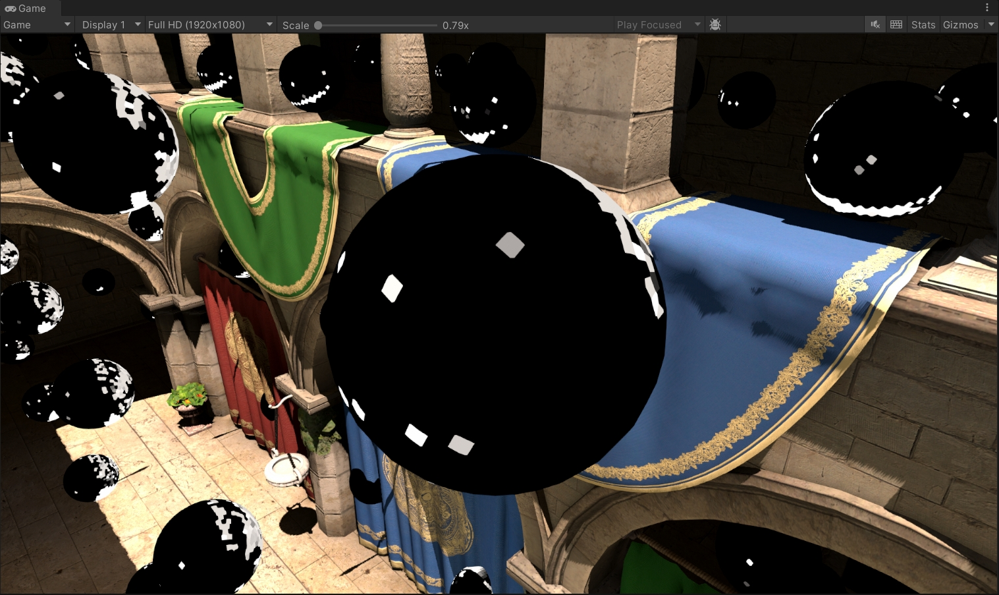
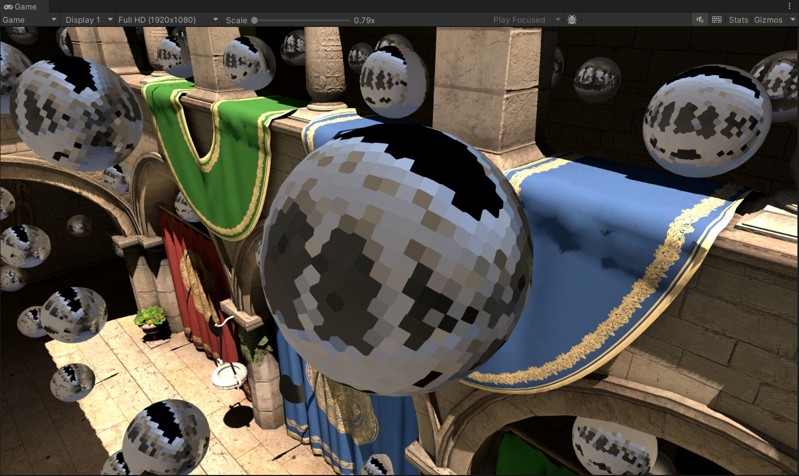
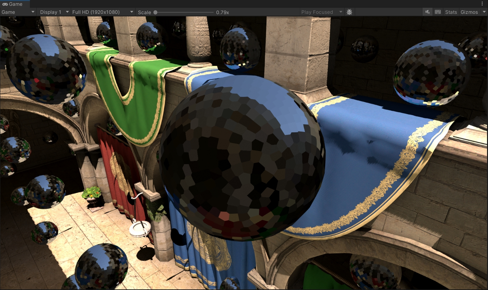

# URP Dynamic Diffuse Global Illumination (DDGI)

基于 Unity URP 14.0 + DXR 的动态漫反射全局光照系统，参考 NVIDIA RTXGI SDK 实现。在三维均匀网格上布置光照探针，每帧通过硬件光线追踪更新 irradiance / distance atlas，为场景提供实时间接光照。

## 效果展示


## 渲染管线

```
Per Frame:
  Build RTAS → Dispatch Rays → G-Buffer
  → [Probe Relocation] → [Probe Classification]
  → LightingCombined (Direct + Indirect + Radiance, single pass)
  → Monte Carlo Integration (Irradiance + Distance Atlas)
  → [Variability Reduction] → Border Update → Ping-Pong Swap

Apply GI (URP RendererFeature):
  Depth → World Pos → Sample DDGI Atlas (trilinear + Chebyshev) → Additive Composite
```

## 关键技术实现

### 各阶段可视化

| Direct Irradiance | Indirect Irradiance | Outgoing Radiance | Irradiance |
|:---:|:---:|:---:|:---:|
|  |  |  |  |

| Probe Relocation |
|:---:|
|  |

### 实现细节

- 直接光照、间接光采样与 radiance 合成压缩至单个 compute pass（`LightingCombined`），消除中间缓冲区
- Atlas 采用 ping-pong 双缓冲，写入 Current、读取 Prev，零拷贝交换
- 光线方向基于 Fibonacci 球面均匀分布 + Halton 序列逐帧随机旋转
- Monte Carlo 积分使用指数滑动平均（hysteresis），irradiance 采用 gamma 编码（γ=5.0）提升暗部精度
- Probe Relocation 自动移动陷入几何体的探针，Classification 基于背面命中比例标记无效探针
- Variability Reduction 通过多级归约 + `AsyncGPUReadback` 驱动自适应更新频率
- 漏光抑制：surface bias、Chebyshev visibility test、weight crushing
- GI 应用阶段三线性插值 + 切比雪夫可见性加权采样周围 8 个探针


## 目录结构

```
Assets/DDGILightProbe/
├── Runtime/
│   ├── Core/              DDGIVolume, DDGIRaytracingManager, DDGIProbeUpdater,
│   │                      DDGIAtlasManager, DDGIApplyGIRendererFeature,
│   │                      DDGIProbeVisualizer, DDGISkyOnlyValidator ...
│   └── Shaders/
│       ├── DDGILightingCombined.compute      合并光照 Pass
│       ├── DDGIMonteCarloIntegration.compute  蒙特卡洛积分 + Border Update
│       ├── DDGIProbeRelocation.compute        探针重定位
│       ├── DDGIProbeClassification.compute    探针分类
│       ├── DDGIVariabilityReduction.compute   变异度归约
│       ├── DDGISampling.hlsl                  Atlas 采样公共库
│       ├── DDGIApplyGI.shader                 全屏 GI 叠加
│       └── DDGIRaytracing/                    RayGen, ClosestHit, Miss, GBuffer
└── Editor/                Volume / Updater / Visualizer / Validator Inspector
```

## 环境要求

- Unity 2022.3+，Windows，DirectX 12
- 支持 DXR 1.0 的 GPU（NVIDIA RTX / AMD RX 6000+）
- URP 14.0+，Deferred Rendering Path

## 配置步骤

1. URP Renderer 添加 `DDGIApplyGIRendererFeature`
2. 场景中创建 `GameObject → Light → DDGI Volume`
3. `DDGIProbeUpdater` 设为 Raytracing 模式，点击「自动查找 Shaders」
4. 调整 Volume 参数，Play Mode 即可看到实时 GI

## 参考

- [NVIDIA RTXGI SDK](https://github.com/NVIDIAGameWorks/RTXGI)
- Majercik et al., *Dynamic Diffuse Global Illumination with Ray-Traced Irradiance Fields*, JCGT 2019
- Majercik et al., *Scaling Probe-Based Real-Time Dynamic Global Illumination for Production*, JCGT 2021

## 许可与致谢

本项目包含的 Sponza 场景资源受以下许可约束：
- Sponza 模型：CC BY 3.0 — © 2010 Frank Meinl, Crytek
- NoEmotion HDRs 纹理：CC BY-ND 4.0 — © 2022 Peter Sanitra

详细版权信息见 `Assets/com.unity.sponza-urp@5665fb87d0/copyright.txt`。
